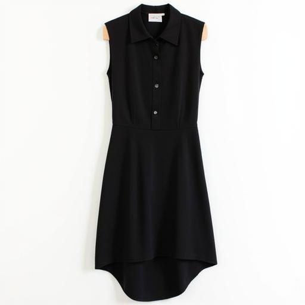
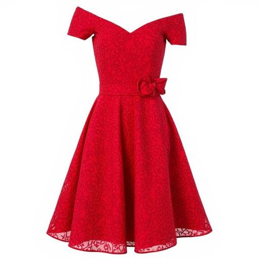
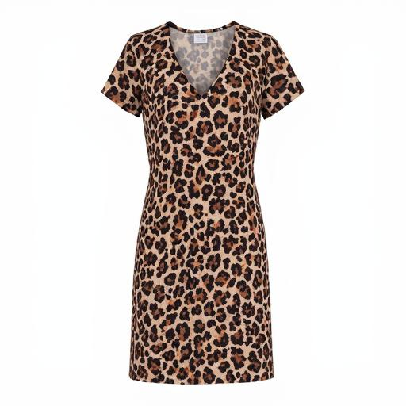
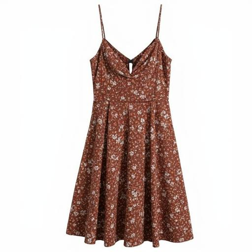

# FLUX.1-dev Outfit Generator Gradio Demo
## by TryOn Labs (https://www.tryonlabs.ai)
Generate an outfit by describing the color, pattern, fit, style, material, type, etc.

## Model description 

FLUX.1-dev LoRA Outfit Generator can create an outfit by detailing the color, pattern, fit, style, material, and type.

## Dataset used

H&M Fashion Captions Dataset - 20.5k samples
https://huggingface.co/datasets/tomytjandra/h-and-m-fashion-caption

## Repository used

AI Toolkit by Ostris
https://github.com/ostris/ai-toolkit

## Download model

Weights for this model are available in Safetensors format.

[Download](https://huggingface.co/tryonlabs/FLUX.1-dev-Outfit-Generator/tree/main) them in the Files & versions tab.

## Install dependencies

```
git clone https://github.com/tryonlabs/FLUX.1-dev-Outfit-Generator.git
cd FLUX.1-dev-Outfit-Generator
conda create -n demo python=3.12
pip install -r requirements.txt
conda install pytorch pytorch-cuda=12.4 -c pytorch -c nvidia
```

## Run demo

```
gradio app.py
```

## Generated images


#### A dress with Color: Black, Department: Dresses, Detail: High Low,Fabric-Elasticity: No Sretch, Fit: Fitted, Hemline: Slit, Material: Gabardine, Neckline: Collared, Pattern: Solid, Sleeve-Length: Sleeveless, Style: Casual, Type: Tunic, Waistline: Regular
***

#### A dress with Color: Red, Department: Dresses, Detail: Belted, Fabric-Elasticity: High Stretch, Fit: Fitted, Hemline: Flared, Material: Gabardine, Neckline: Off The Shoulder, Pattern: Floral, Sleeve-Length: Sleeveless, Style: Elegant, Type: Fit and Flare, Waistline: High
***

#### A dress with Color: Multicolored, Department: Dresses, Detail: Split, Fabric-Elasticity: High Stretch, Fit: Fitted, Hemline: Slit, Material: Gabardine, Neckline: V Neck, Pattern: Leopard, Sleeve-Length: Sleeveless, Style: Casual, Type: T Shirt, Waistline: Regular
***

#### A dress with Color: Brown, Department: Dresses, Detail: Zipper, Fabric-Elasticity: No Sretch, Fit: Fitted, Hemline: Asymmetrical, Material: Satin, Neckline: Spaghetti Straps, Pattern: Floral, Sleeve-Length: Sleeveless, Style: Boho, Type: Cami Top, Waistline: High
***

## License

[License](LICENSE) them in the Files & versions tab.